<h1 align="center"> Sobrio theme </h1>

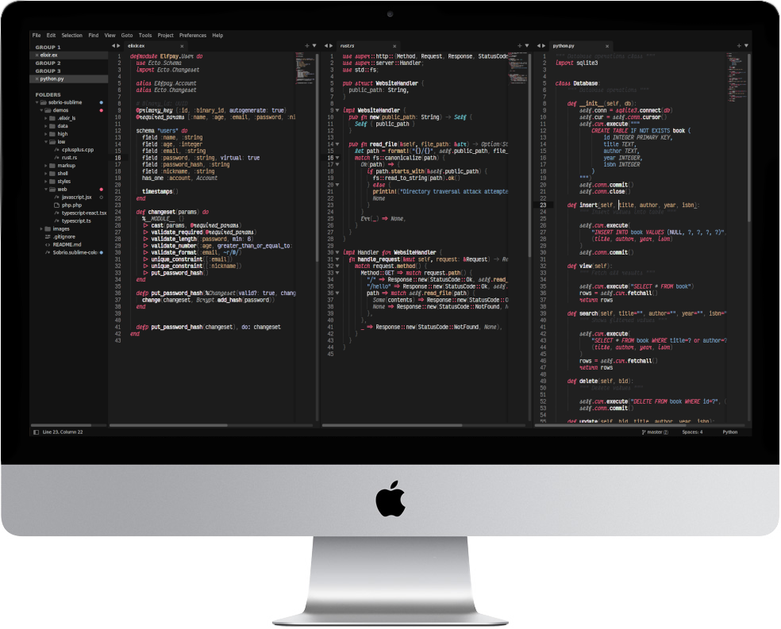

## About this theme

Sobrio is a theme for **Sublime Text**, with sober colors (at least for me), hence the name. The font used in the screenshots is [Victor Mono](https://rubjo.github.io/victor-mono/), so _real italics_ and _ligatures_ are supported if that fits your style.

The syntax was tested with the following languages:

- CSS / Sass / SCSS
- Elixir
- HTML / SVG / XML
- JavaScript / Typescript / JSX / TSX
- JSON
- Markdown
- PHP
- Python
- Rust
- YAML

---

## Screenshots

### HTML

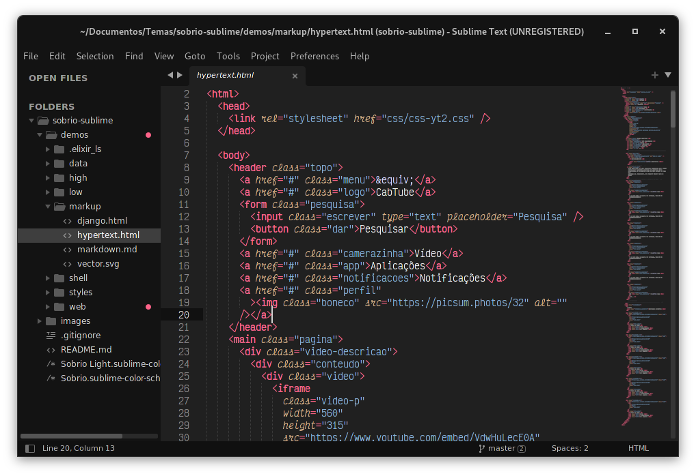

### JavaScript / Typescript

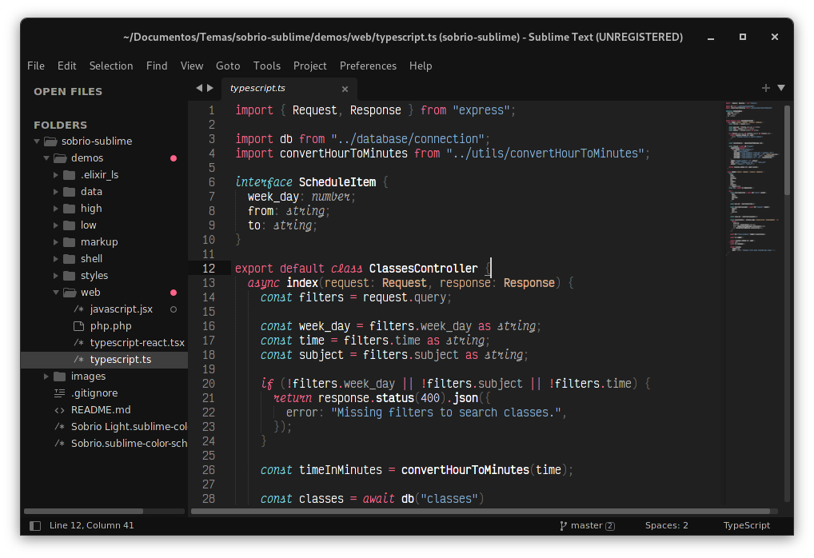

### React

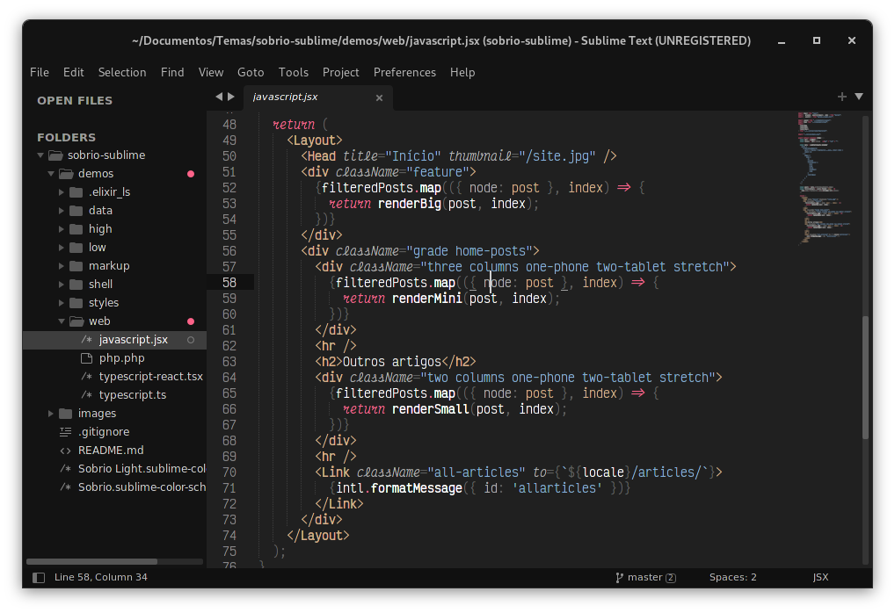

### CSS

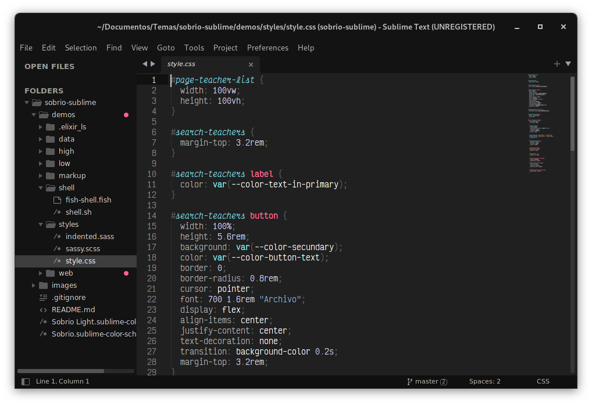

### SCSS

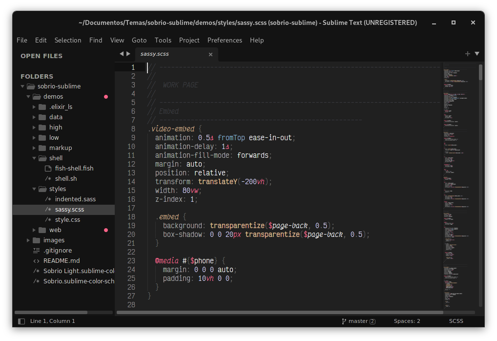

### Sass

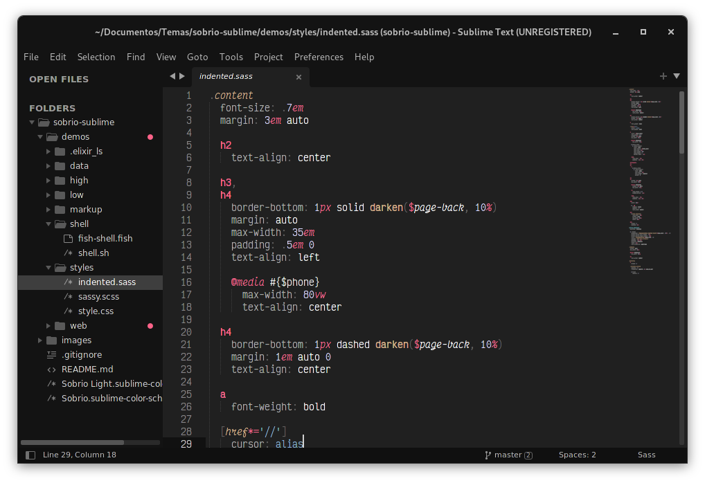

### SVG

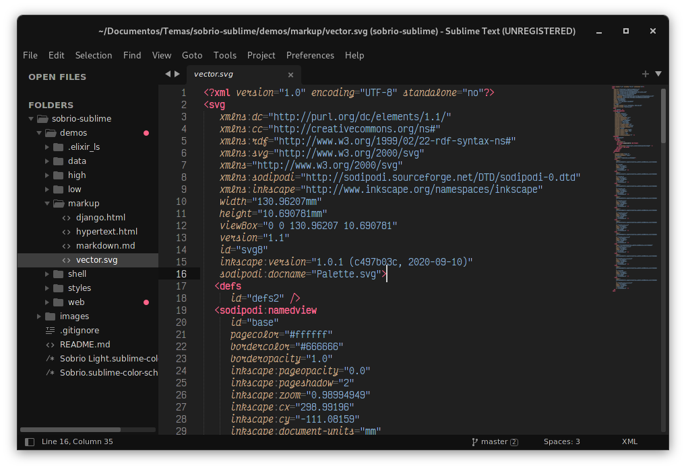

### YAML

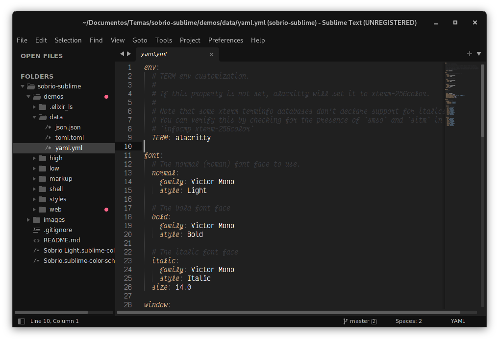

### JSON

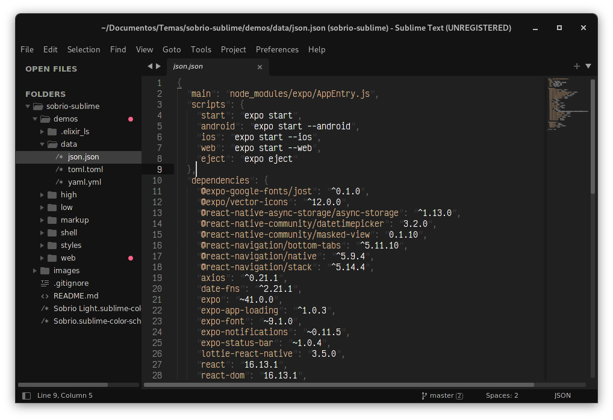

### Python

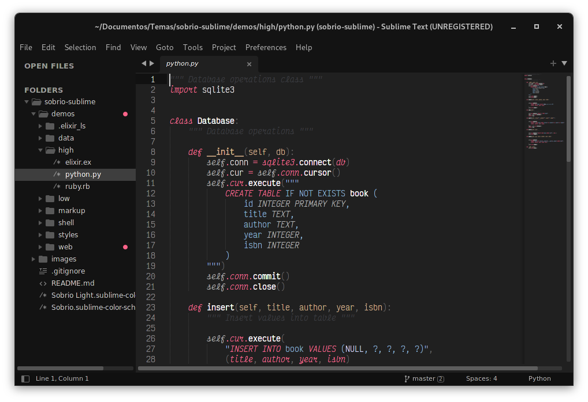

### PHP

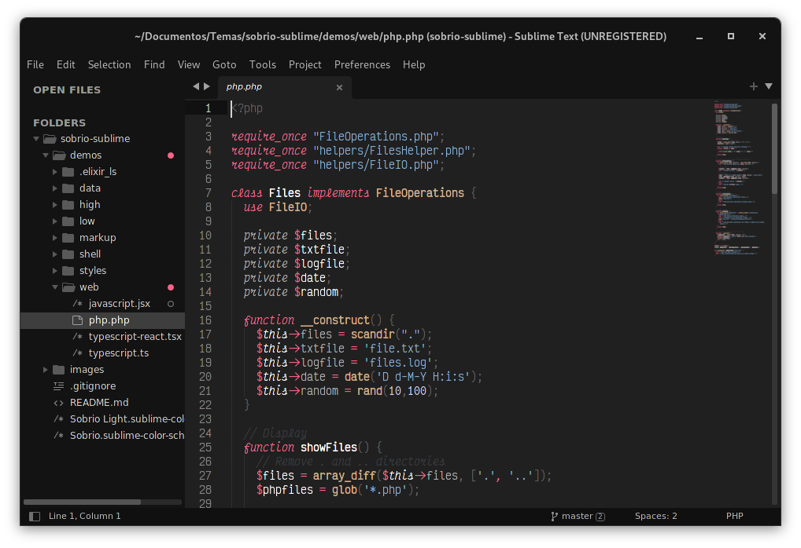

### Rust

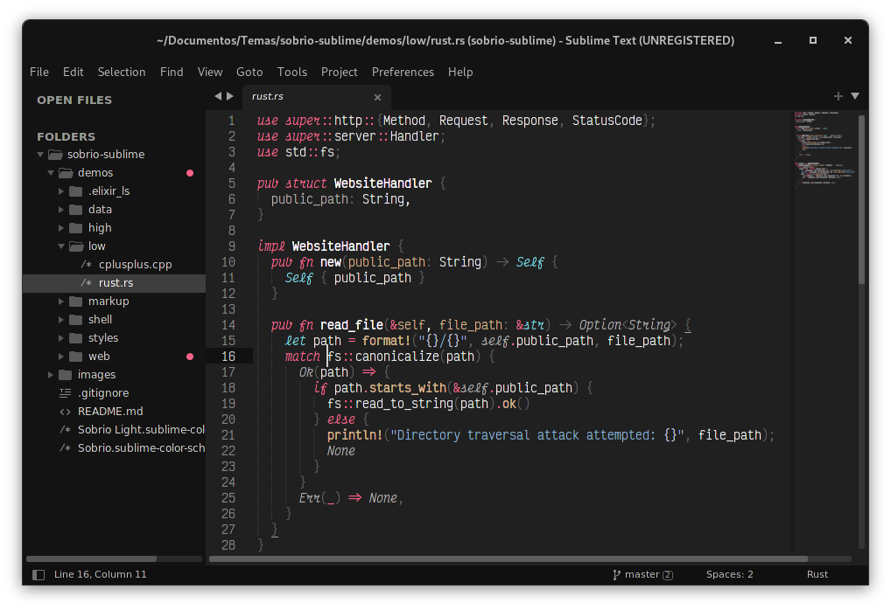

### C++

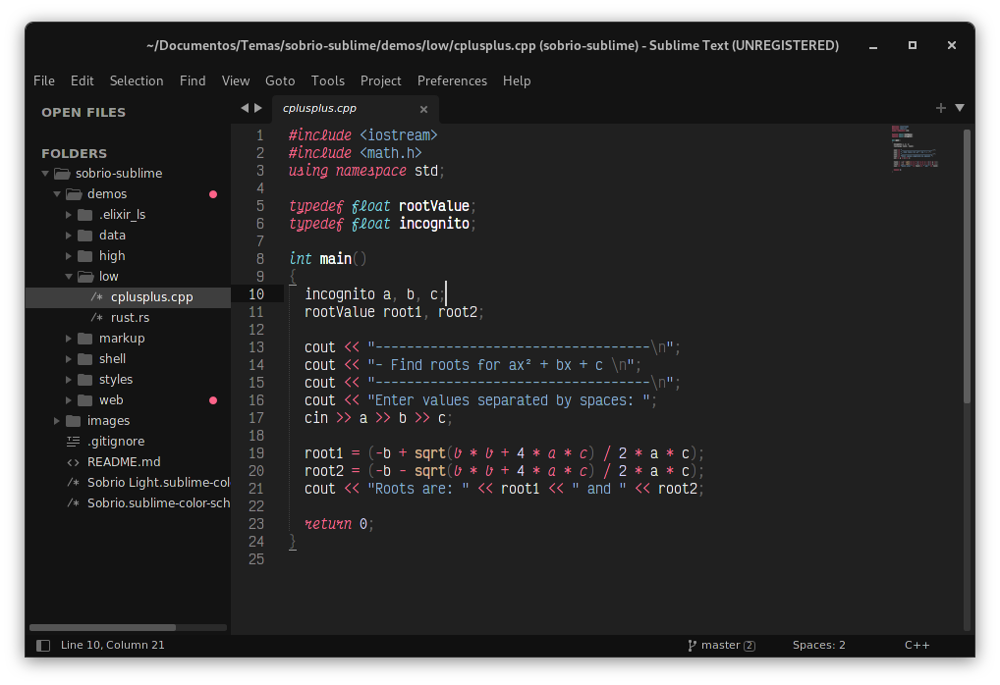

That's all folks!
